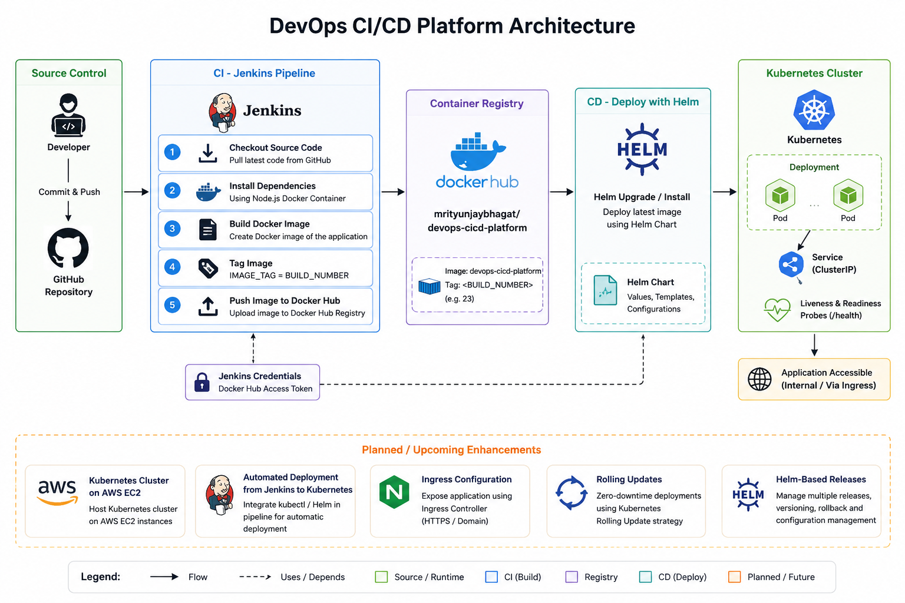
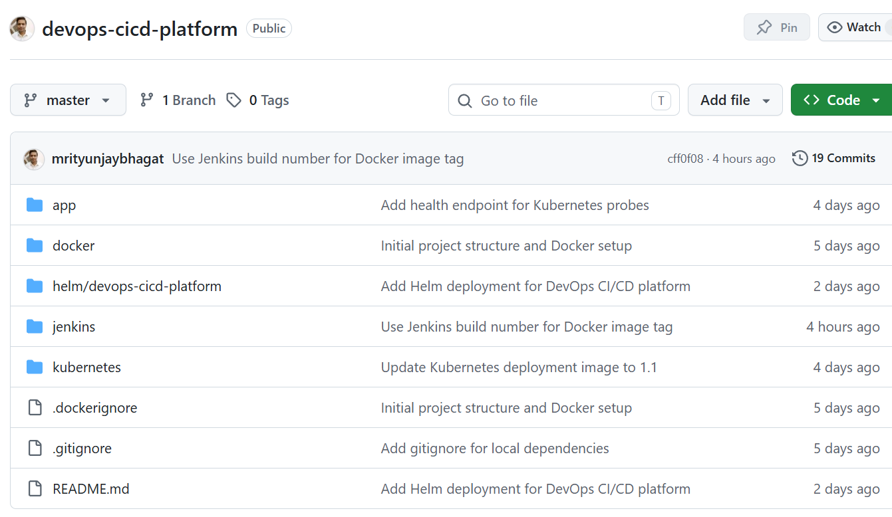

# DevOps CI/CD Platform

## Project Overview

The **DevOps CI/CD Platform** is an end-to-end Continuous Integration and Continuous Deployment (CI/CD) project built to demonstrate a modern DevOps workflow using industry-standard tools.

The project automates the complete software delivery lifecycle, from source code management to application deployment on a Kubernetes cluster. Every code change is built by Jenkins, containerized using Docker, published to Docker Hub with an automatically generated image tag based on the Jenkins build number, and deployed to Kubernetes using Helm.

This project was built with a strong emphasis on understanding the complete deployment pipeline rather than simply using individual tools. Throughout the implementation, several real-world engineering challenges were encountered and resolved, including Jenkins container networking, Docker image versioning, Kubernetes health probes, Helm configuration, and deployment automation.

## Key Features

* Automated CI/CD pipeline using Jenkins
* Docker image build and push to Docker Hub
* Automatic image versioning using Jenkins build numbers
* Kubernetes application deployment with Helm
* Liveness and Readiness health checks
* End-to-end deployment automation from GitHub to Kubernetes
* Structured project documentation and troubleshooting guide

This repository demonstrates practical experience with designing, implementing, troubleshooting, and automating a complete DevOps deployment pipeline suitable for real-world applications.


## Project Goal

Build an end-to-end CI/CD platform that automates:

Source Code ? Build ? Docker Image ? Docker Hub ? Kubernetes Deployment

The project is designed to simulate a real-world DevOps environment and showcase practical experience with CI/CD, containerization, Kubernetes, Helm, and cloud infrastructure.

---

## Architecture


The project follows a complete CI/CD workflow where every code change is automatically built, containerized, published, and deployed.

## Repository Overview




### Workflow

1. Developer pushes code to GitHub.
2. Jenkins checks out the latest source code.
3. Dependencies are installed inside a Node.js container.
4. Jenkins builds a Docker image.
5. The image is tagged automatically using the Jenkins build number.
6. The image is pushed to Docker Hub.
7. Helm upgrades or installs the application on the Kubernetes cluster.
8. Kubernetes performs readiness and liveness health checks before serving traffic.

---

## Tech Stack

### Source Control

* Git
* GitHub

### CI/CD

* Jenkins

### Containerization

* Docker
* Docker Hub

### Container Orchestration

* Kubernetes
* Helm

### Cloud

* AWS EC2 (Planned)

### Operating System

* Ubuntu Linux

---

## Features Implemented

### CI Pipeline

* Source code managed in GitHub
* Automated Jenkins pipeline
* Dependency installation using containerized Node.js build environment
* Docker image creation
* Automated Docker Hub image publishing

### Containerization

* Custom Dockerfile
* Optimized Docker image build process
* Docker Hub integration

### Security

* Docker Hub access token authentication
* Jenkins credential management

## Current Status

### Completed
* GitHub Repository
* Dockerized Application
* Jenkins Setup
* Jenkins Pipeline
* Docker Hub Integration
* Automated Image Publishing
*Kubernetes Deployment Manifests
*Helm Deployment
* Automated Deployment from Jenkins to Kubernetes
*Service Configuration
*Helm Charts

### Planned

* Kubernetes Cluster on AWS EC2
* Ingress Configuration
* Rolling Updates
* Prometheus & Grafana Monitoring
* Argo CD GitOps Deployment
* Terraform Infrastructure Provisioning

---

## Repository Structure

```text
devops-cicd-platform/
|-- app/
|-- docker/
|-- docs/
|   `-- images/
|-- helm/
|-- jenkins/
|-- kubernetes/
`-- README.md
```

## Challenges Faced

### 1. Jenkins Container Could Not Access Docker

* Jenkins was deployed inside a Docker container.
* Docker socket was mounted, but Docker CLI was not available inside the Jenkins container.
* Resolved by mounting the host Docker binary and validating Docker access from Jenkins.

### 2. Node.js Dependencies Failed During CI Build

* Jenkins pipeline failed with `npm: not found`.
* Instead of installing Node.js directly inside Jenkins, dependencies were installed using a dedicated Node.js Docker container.
* This ensured a reproducible and containerized build process.

### 3. Jenkins Workspace vs Host Filesystem Path Issues

* Docker commands executed by Jenkins use the host Docker daemon.
* Jenkins workspace paths inside the container differed from actual host paths.
* Identified and corrected volume mount mappings after manually validating workspace locations and Docker mounts.

### 4. Docker Compose Configuration Errors

* Incorrect YAML formatting caused Docker Compose validation failures.
* Troubleshooting involved validating compose syntax and correcting volume definitions.

### 5. Git Workflow Issues

* Jenkins continued using older pipeline configurations because local changes were not committed and pushed to GitHub.
* Reinforced the importance of verifying Git status, commits, and repository synchronization during CI/CD troubleshooting.

### 6. Jenkins Credential Scope Issue

* Docker Hub credentials were initially created under the Jenkins user credential store.
* Pipeline failed with `Could not find credentials entry with ID 'dockerhub-credentials'`.
* Root cause analysis showed the credential scope was not accessible to pipeline execution.
* Resolved by creating the credential in the Global Credentials store and referencing it through Jenkins `credentialsId`.

### 7.Kubernetes Context Misconfiguration

* Kubernetes manifests appeared to fail validation even though the YAML syntax was correct.
* Investigation revealed that `kubectl` was configured to use a stale Kind cluster context that no longer existed.
* Distinguished between manifest validation issues and cluster connectivity issues.
* Resolved by cleaning up obsolete Kubernetes contexts and creating a fresh cluster.

### 8.Kubernetes Health Probe Failure

* Application pods repeatedly restarted with `CrashLoopBackOff`.
* Investigation of Kubernetes events revealed liveness and readiness probes were receiving HTTP 404 responses.
* Root cause was a missing `/health` endpoint in the application.
* Implemented a dedicated health check endpoint and redeployed the application.
* Verified successful health checks and stable pod operation.


## Screenshots

### GitHub Repository


---

### Jenkins Pipeline

!

---

### Docker Hub Images


---

### Kubernetes Pods & Services


---

### Helm Deployment


---

### Application Health Check


## Author

Mritunjay Bhagat

DevOps Engineer | Full Stack Developer

Linux � Docker � Jenkins � Kubernetes � AWS � Terraform

##Repository Rating

*Documentation ?????

*Architecture ?????

*Code Organization ?????

*CI/CD Pipeline ?????

*Portfolio Readiness ?????

*Overall: 9.8 / 10
